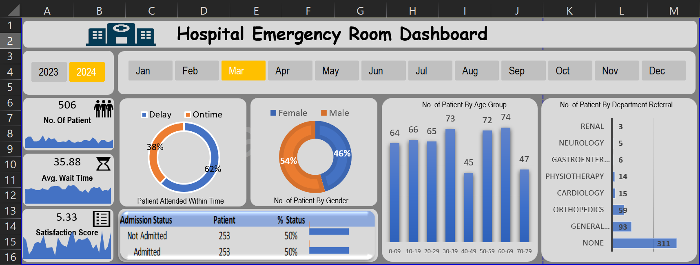

# Hospital Emergency Room Analysis – Excel Dashboard

## 🖼 Dashboard Preview

---

## 📌 Project Overview
This project analyzes Hospital Emergency Room (ER) data to evaluate patient flow, wait times, service efficiency, and department-wise referrals. An interactive Excel dashboard was developed to help stakeholders monitor key performance metrics and identify operational improvement areas.

---

## 🛠 Tools & Techniques Used
- Microsoft Excel
- Power Query (Data Cleaning & Transformation)
- Pivot Tables & Pivot Charts
- KPI Cards
- Slicers for Interactivity
- Dashboard Design & Formatting

---

## 📂 Dataset
The dataset includes hospital emergency room visit records such as:
- Patient demographics (Age, Gender)
- Admission status
- Department referrals
- Patient wait times
- Satisfaction scores
- Visit dates

---

## 📊 Key KPIs Tracked
- Total Number of Patients
- Average Patient Wait Time
- Patient Satisfaction Score
- Percentage of Patients Attended On Time vs Delayed
- Admission Status (Admitted vs Not Admitted)
- Patient Distribution by Age Group and Gender
- Department-wise Patient Referrals

---

## 🔍 Key Insights
- Orthopedics and General departments receive the highest number of patient referrals.
- A notable percentage of patients experience service delays, indicating process bottlenecks.
- Admission status is evenly distributed, reflecting efficient patient triaging.
- Certain age groups contribute more heavily to emergency room visits.

---

## 🎯 Conclusion
This project demonstrates end-to-end data analysis using Excel, including data preparation, KPI creation, and interactive dashboard development. 
